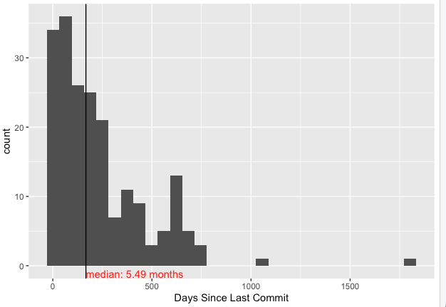

# Analyzing Github Data for Awesome Gleam

This analysis was inspired by an interaction on the Gleam Language Discord server. In early December 2025, I was experimenting with writing a statistical package in the Gleam programming language, as I had heard that the community was welcoming and friendly. 

I asked a question about polymorphism between the Floats and Ints. Many interactions I had were not pleasant, but one was particularly unpleasant: 

> If you don't contribute, there are other people who will. So, you aren't that special ig.

# Who are contributing to Gleam?

Gleam doesn't have a large core language. So it is essential that there be a vibrant ecosystem of libraries from which the end user can pick from in order to accomplish their tasks. Gleam advertises this ecosystem in [Awesome Gleam](https://github.com/gleam-lang/awesome-gleam).

Is it true that people will contribute? I took a snapshot of the ~200 packages on Awesome Gleam on 2025-12-18 and pulled some data using the Github API. The [data tell a different story](graphs/days-since-commit.png). The median number of months since the last commit was 5.49. In other words, 50% of all packages on Awesome Gleam have not been updated in 5.5 months, as of 2025-12-18.

# Usage

(This script has not been edited for style or best practices in Python.)

Clone this repository. Add your [Github Personal Access Token](https://docs.github.com/en/authentication/keeping-your-account-and-data-secure/managing-your-personal-access-tokens) to the script. Then run `python script.py`.
